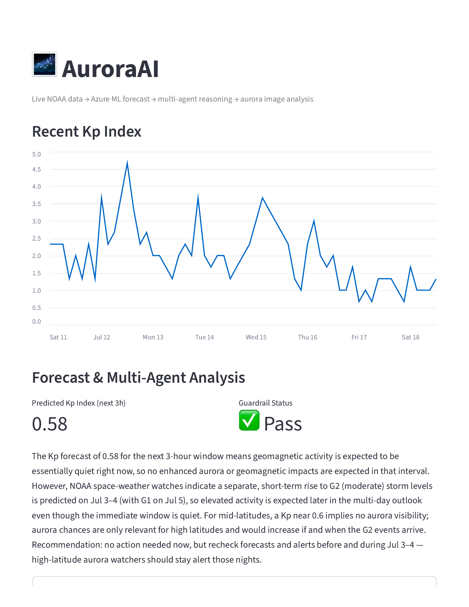
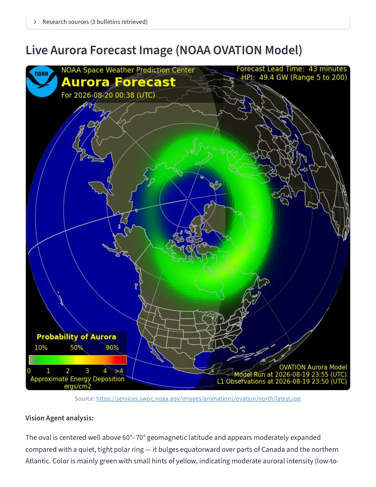
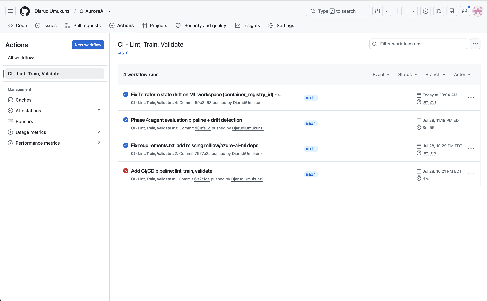
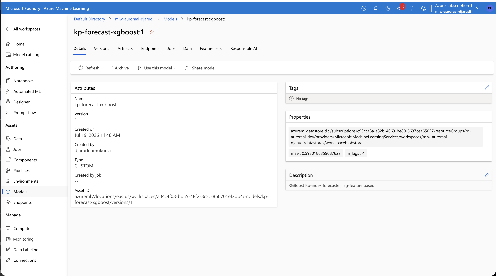

# AuroraAI

An end-to-end space weather forecasting system built on Azure's AI and data platform — live NOAA data ingestion, a governed ML platform, a multi-agent reasoning system, MLOps/GenAIOps tooling, and a dashboard that ties it all together with real-time computer vision.

Built as a hands-on capstone project ahead of a Microsoft Cloud Application Development cohort, aimed at demonstrating production-representative Azure engineering across data, ML, and generative AI — not a tutorial walkthrough.





## What it does

AuroraAI pulls live space weather data from NOAA's Space Weather Prediction Center, forecasts the next 3-hour Kp geomagnetic index using a registered XGBoost model, and runs a multi-agent pipeline (Research → Forecast → Reasoning → Guardrail) to produce a grounded, plain-language explanation of current conditions — cross-referenced against a live NOAA aurora forecast image analyzed by a vision-capable LLM.

## Architecture

| Phase | What's built |
|---|---|
| **0 — Foundation** | Microsoft Foundry resource, Azure OpenAI (`gpt-5-mini` for reasoning, `text-embedding-3-small` for retrieval) |
| **1 — Data Platform** | ADLS Gen2 medallion lakehouse (bronze/silver/gold), Azure Data Factory with a parameterized ForEach pipeline ingesting 6 NOAA endpoints, Databricks + Unity Catalog external locations for governed storage access, PySpark bronze→silver→gold Delta transforms |
| **2 — ML Platform** | Azure ML workspace, MLflow experiment tracking, a versioned model registry (`kp-forecast-xgboost`) |
| **3 — Multi-Agent AI** | Azure AI Search (vector RAG over NOAA bulletins), a LangGraph Supervisor orchestrating Research, Forecasting, and Reasoning agents plus a guardrail check |
| **4 — MLOps/GenAIOps** | GitHub Actions CI/CD (lint, retrain, validate), an LLM-as-judge agent evaluation pipeline (groundedness/relevance/safety), KS-test drift detection, OpenTelemetry tracing to Application Insights, a live Azure budget alert, Terraform for all infrastructure |
| **5 — Dashboard + CV** | A Streamlit dashboard unifying the forecast, the full multi-agent explanation, and a live NOAA aurora forecast image analyzed by `gpt-5-mini`'s vision capability |

All infrastructure is provisioned via Terraform (`terraform/`) — nothing was clicked into existence without a corresponding `.tf` file, aside from a couple of Portal-only steps noted inline (model deployments, Unity Catalog credentials).

## Repository layout

```
agent/          Multi-agent system: research, forecasting, reasoning, supervisor, vision, evaluation
data/           NOAA data ingestion
models/         Model training + drift detection
dashboard/      Streamlit app
mlops/          Azure ML pipeline (see note below), conda env spec
terraform/      All infrastructure as code
.github/workflows/  CI/CD pipeline
docs/           Cost optimization notes, screenshots
```

## Setup

```bash
python -m venv .venv
source .venv/bin/activate
pip install -r requirements.txt
cp .env.example .env   # fill in your own Azure resource values
```

Provision infrastructure:
```bash
cd terraform
terraform init
terraform apply
```

Run the pipeline:
```bash
python data/fetch_noaa_data.py
python models/train_model.py
python agent/build_search_index.py    # first time only, or after new bulletins
streamlit run dashboard/app.py
```

## Known limitation

The Azure ML cloud retraining pipeline (`mlops/retrain_pipeline.py`) is currently blocked by a confirmed bug in the `azure-ai-ml` SDK's code-asset resolution path (not a project configuration issue — root cause independently verified via direct datastore diagnostics; see comments in the file for the full trail). Local + CI-based retraining (`.github/workflows/ci.yml`) works and is the actively used path.

## What went wrong (and got fixed)

Real infrastructure work surfaces real problems. A few worth naming, since working through them was as much a part of this project as the code itself:
- NOAA deprecated several data endpoints mid-project; the ingestion script was updated to the replacement endpoints
- Azure Databricks retired the Standard SKU; Terraform config updated to Premium
- A Key Vault stuck in legacy Access Policy mode caused a cascade of confusing "unauthorized" errors across two separate phases before being correctly diagnosed and fixed (`enable_rbac_authorization`)
- MLflow's newer client versions have a compatibility gap with Azure ML's tracking server; worked around via direct Azure ML SDK model registration
- An accidental Azure ML workspace soft-delete was caught, diagnosed independently of Terraform, and recovered without data loss
- A regional compute-quota wall blocked Databricks classic clusters and Azure ML compute clusters; resolved by using serverless compute throughout, which auto-selects from actual available quota

## Cost optimization

See [`docs/COST_OPTIMIZATION.md`](docs/COST_OPTIMIZATION.md) for the specific decisions made to keep this cheap to run (Free-tier AI Search, LRS storage, serverless compute, a live budget alert) and where those choices would change for a production deployment.